# 课程设计报告

大三下编译原理课程设计实验报告

完成人:完美女仆早坂爱~


## 参考代码

[andrewei1316/Compiler: 基于 Python 的词法和LR(1)文法分析器 (github.com)](https://github.com/andrewei1316/Compiler)

[kervias/compile-lab: 编译原理实验 (github.com)](https://github.com/kervias/compile-lab)

## 环境说明

+ Python 3.9
+ Pyqt5
+ Win10及Ubuntu20.04均可
+ QtDesigner(此项仅在开发环境中使用)

## 项目文件说明

| 文件名                         | 说明                                                      |
| ------------------------------ | --------------------------------------------------------- |
| inputCode.c                    | 在输入框内保存的字符串                                    |
| lexical_analyze_with_gui.py    | 词法分析，运行该程序可有ui页面                            |
| lexical_analyze_gui.ui         | 词法分析ui设计文件，可删去                                |
| lexical_analyze_gui.py         | 根据词法分析ui设计文件生成的py文件                        |
| lexical_analyze_with_nonGui.py | 词法分析，无ui页面                                        |
| lexical_grammar                | 自定义的词法                                              |
| node.py                        | 数据体结构，存放LR1分析的项集信息；存放NFA与DFA中节点信息 |
| syntax_analyze_with_gui.py     | 语法分析，运行该程序可有ui页面                            |
| syntax_analyze_gui.ui          | 语法分析ui设计文件，可删去                                |
| syntax_analyze_gui.py          | 根据语法分析ui设计文件生成的py文件                        |
| syntax_analyze_with_nonGui.py  | 语法分析，无ui页面                                        |
| syntax_false_result            | 语法分析错误结果                                          |
| syntax_grammar                 | 自定义的语法                                              |
| syntax_result                  | 语法分析的结果                                            |
| token_table                    | 词法分析的结果                                            |
| test                           | 该文件夹下存放测试程序                                    |
| requirements.txt               | 项目所依赖的python包                                      |

## 运行说明

### 词法分析

```
python lexcial_analyze_with_gui.py		#图形化页面
python lexcial_analyze_with_nogui.py	#非图形化页面
```

### 语法分析

```
python syntax_analyze_with_gui.py		#图形化页面
python syntax_analyze_with_nogui.py		#非图形化页面
```

### 相关资源说明

词法分析默认提供了一个正规文法文件lexical_grammar，词法分析默认提供了一个2型文法文件syntax_grammar

输入分析的源代码在inputCode.c中

同时在test文件夹下还提供了几个简单的测试案例，用户可自行尝试修改


## 词法分析

### 	1.任务初步分析

我构造了一个3型文法作为程序读入的词法的文法，便于输入，我将空产生式的右部的 ε 用 $ 来代替。
同时token的类型大体分成了 identifier、limiter、operator、number、string 等五类, 并每一类设计了表达式和推导过程。

对于每个**词素（lexeme**），词法分析器都会产生如下形式的**词法单元（token）**作为输出：

< token-name ,attribute-value >	(详见编译原理黑皮书P3)

**token-name**是在**语法分析**步骤中使用的抽象符号，

**attribute-value**可以看作是指针或者序号，指向符号表中关于这个词法单元的条目，而符号表条目的信息会被**语义分析和代码生成**步骤使用。


根据题意，程序的输出是一个 token（令牌）表，该表由 5 种 token 组成：关键词，标识符，常量，限定符和运算符。

但在这里如果按照要求做，再后面的语法分析处理会显得相对复杂，因为限定符有很多种比如 **( ) [ ] { } ; ,**

 同时运算符同样如此，比如**+ -  * / =** 

当然这些也可以限定符和运算符也可以放入符号表中，在符号表中找对应，但这样未免太过曲折；所以在此我们采用黑皮书的思路，用于后面的语法分析的token表我们都将每个关键词，限定符和运算符作为一个单独的词法单元，即单独的token-name，不归结于关键词，限定符和运算符大类中，但展示的我们还是按照题目中来，由这五种token组成。

最后在输出的token_table中呈现的如下的数据结构<token_row, token_col ,token-name ,attribute-value >


*3型文法（正规文法）：设G=（V<sub>N</sub>,V<sub>T</sub>,P,S）,P中的每一个产生式的形式都形如A->aB或A->a*


### 	2.项目设计思路

词法文法设计较为简单，顺着数字，字母，关键词的思路走就行。

词法分析器代码实现步骤遵循下面步骤设计：

初始化：读词法文法->根据产生式构建NFA->将NFA转换为DFA

在初始化的基础上，对于输入的程序或者说字符串，将其放在DFA上运行即可

对于题中要求的特殊数字，比如科学计数法2e10，小数1.11，均已实现

### 	3.运行结果展示

#### 	1.无ui的控制台运行情况

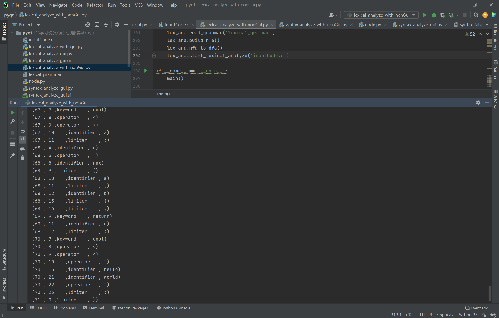

#### 	2.生成的token-table展示

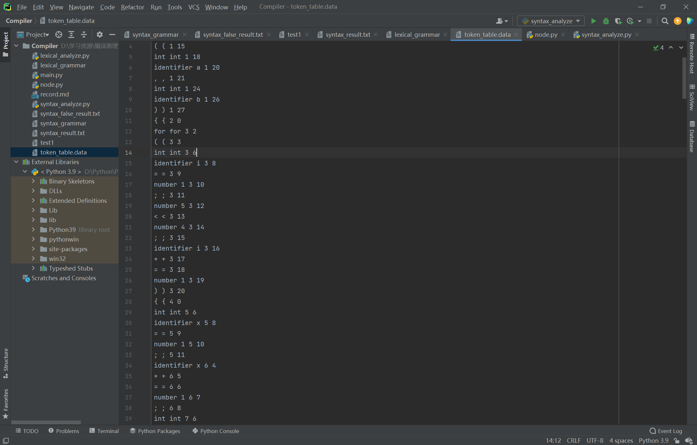

#### 3.有ui的运行情况

##### 页面初始情况

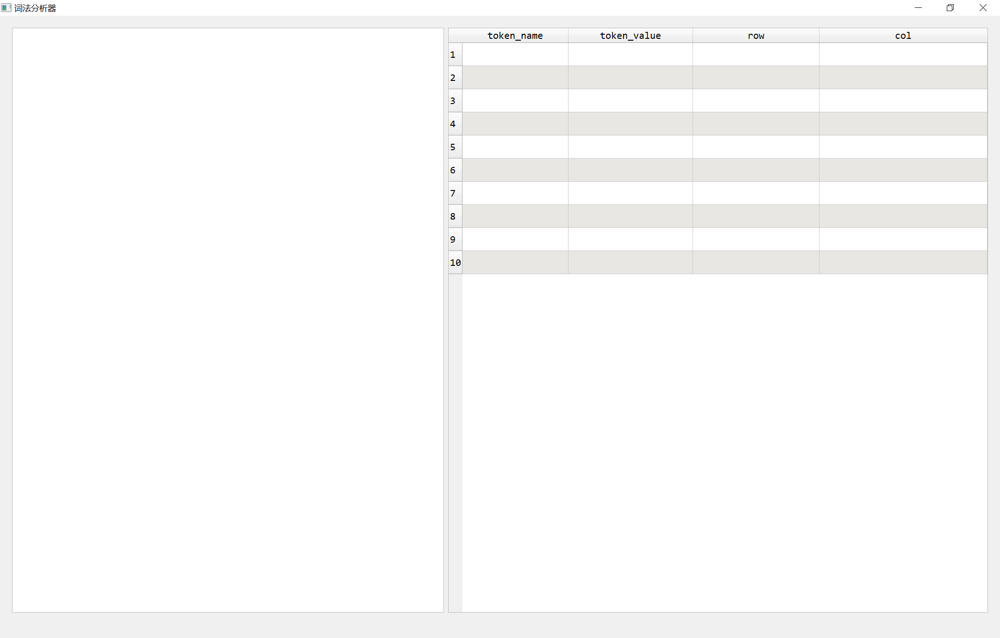

##### 输入后

#### 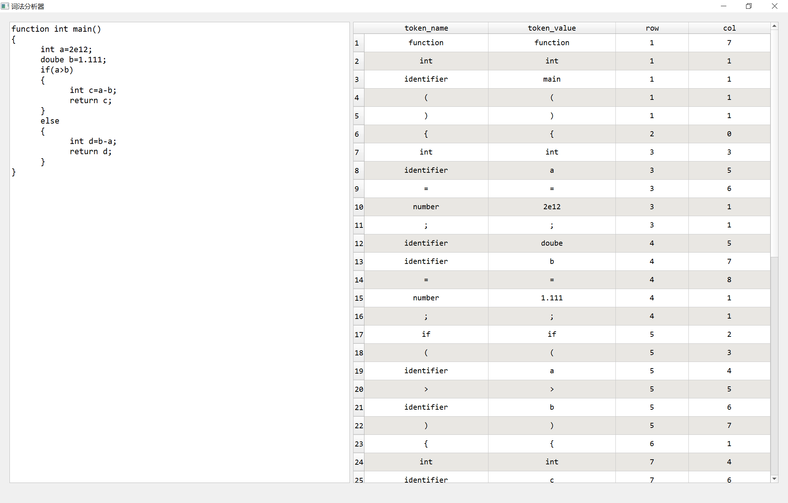

#### 4.错误提示

在这里我们取一个中文的分号作为错误，第29行我们将英文分号改为中文分号，出现错误

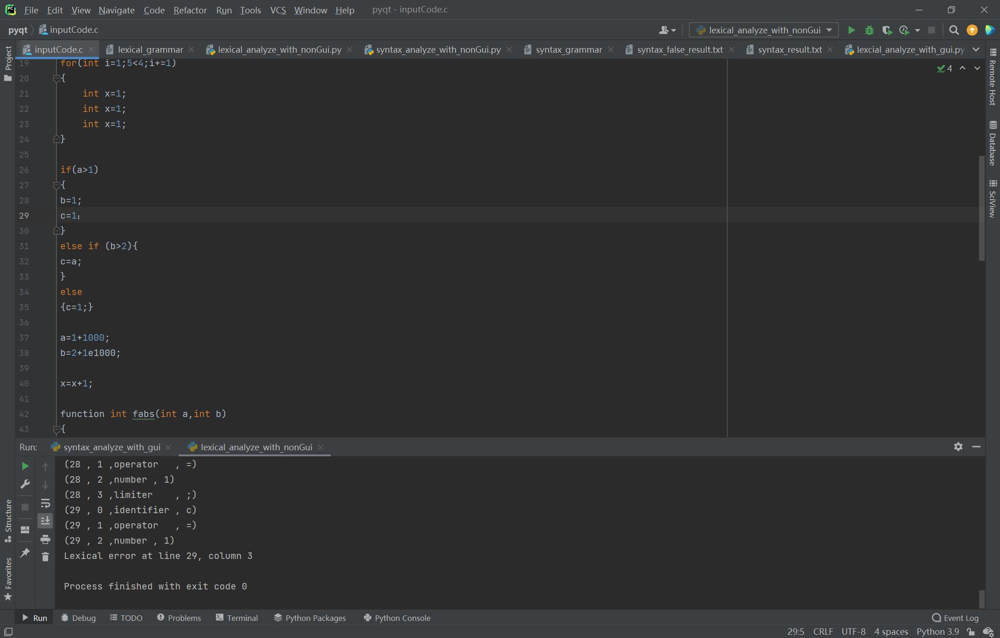


## 语法分析

### 1.任务初步分析

由于要结合任务1生成的token_table，所以需要我们设计的文法必然存在一定的复杂性，单纯的用LL(1)分析极可能出错，及不是符合LL（1）的文法，为了直接一步到位我们直接选取LR（1）方法作为我们设计及分析文法的依准。

### 2.项目实现思路

语法分析较为复杂，下面我们具体分模块进行分析

#### 	1.文法设计

​		文法设计方面意外的花费了自己许多的时间精力，起初以为LR1分析是万能的，什么文法都能正确识别。而后发现不然，自己一开始随便写的文法很容易出现规约-规约冲突，这也是判断文法是不是LR1文法的方式，因为自己是先写分析器后写文法的。

​		由于自己开始按着自己思路怎么写都是错的，于是参考了下微软网站上定义的C语法，网页链接 : [C语言文档](https://docs.microsoft.com/zh-cn/cpp/c-language/c-language-reference?view=msvc-170)，看了一会感觉自己有思路了，先按自己原先的思路画了个树状图，而后跟着树状图理清思路顺着写语法，最后成功写了一个比较满意的语法

##### 	语法设计思路树状图

```mermaid
graph TD;
    语句-->赋值语句
    语句-->判断语句
    语句-->循环语句
    语句-->函数定义语句
    语句-->系统调用语句
    系统调用语句-->输入
    系统调用语句-->输出
    赋值语句-->定义变量
    赋值语句-->赋值变量
    赋值语句-->字符串
    赋值变量-->一般表达式
    赋值变量-->调用函数
    判断语句-->if判断式
    判断语句-->if判断式else判断式
    循环语句-->for
    for-->for1
    for1-->空
    for1-->赋值语句
    for-->for2
    for2-->判断式
    for-->for3
    for3-->语句
    循环语句-->while
```


#### 2.项集的构造

这部分书上说了个用闭包来实现，但如何实现闭包，怎么判断项集间有没有重复，表示项集的符号用什么，向前看符号的改变又如何实现?

伪码的思路差不都是递归的思想，最后自己便用递归实现闭包，至于判断唯一性，以及根据标号找项集，根据项集找其标号，自己都是用dict实现的


#### 3.Action_Goto表的构建

最开始自己想延续在词法分析过程中的思路，把项集也作为一个节点，一样的，用DFA这个图来表示流程，后来因为任务需求需要构造ActionGoto表，做的时候发现自己开始设置的类的LR1Node中edge属性完全没用了，也可以说是自己实现项目过程中的一个小冗余。

在构建action_goto表的过程中开始初始化一个起始点，以开始增广文法的(start1->start)做闭包运算，根据这样项集，对其中的产生式的point. 一个个右移一次，相当于输入，相当于产生新的产生式，对这个产生式做闭包，用前面提到的dict判断存不存在，不存在便可以这个闭包新建一个项集，把这个项集放入队列里，直至队列为空为止，action_goto表或者也可以说DFA便构建完成，过程思想其实也就是BFS的思想。


#### 4.错误提示

错误提示分为两种，一种是文法不是LR（1）文法的错误，一种是分析过程的错误，及当前输入在Action_Goto表中找不到。

对于LR（1）文法的错误提示是输出当前的项集，对于分析过程的错误是提示当前状态项集的项和期望输入，错误位置在token表中以及源输入代码中，以及当前的符号栈与状态栈。

错误提示方面是无意间做出来的，因为自己在开发程序的过程中经常会出现莫名其妙的错误，特别是状态转移时的失败，调试过程中输出当前状态项集的项和期望输入，错误位置在token表中以及源输入代码中，以及当前的符号栈与状态栈。过程中发现大部分问题都是存在于文法设计中，自己文法设计的抽象层次还不够高，因此会漏掉一些情况，当尝试对文法进行打补丁时往往文法又变成不是LR（1）文法了，这个时候就只能重构文法提高它的抽象层次了，以此往复。过程中自己对文法大的重构大约有4次。记得最让人迷惑的一个错误是对字符串处理中，自己在文法中写得是中文 “的双引号，但是代码中是英文的"的双引号，但有了错误提示便还算是比较好发现。


### 3.运行成果展示

#### 1.有ui的运行情况

进入页面初始情况

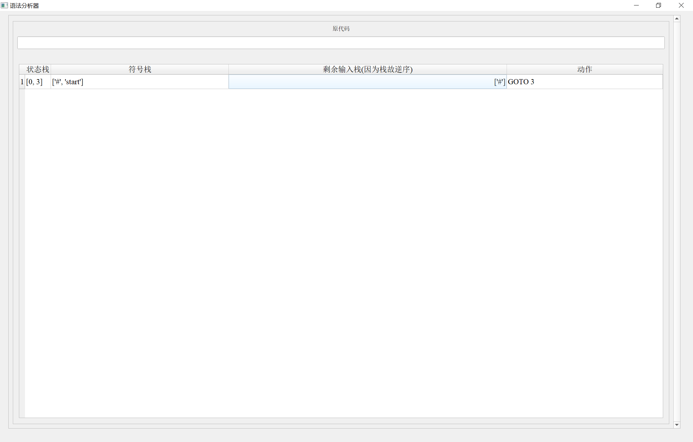

输入一段简单代码后，在此仅截取第一面和最后一面


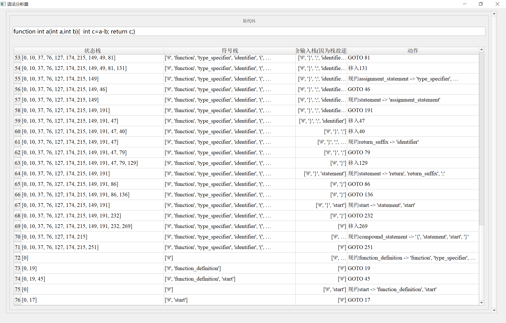

#### 2.无ui的控制台运行情况

##### 1.运行成功

​	此时代码是最简单的 int a=1e10; ,用此目的是便于展示，否则运行过程太过复杂不便于展示

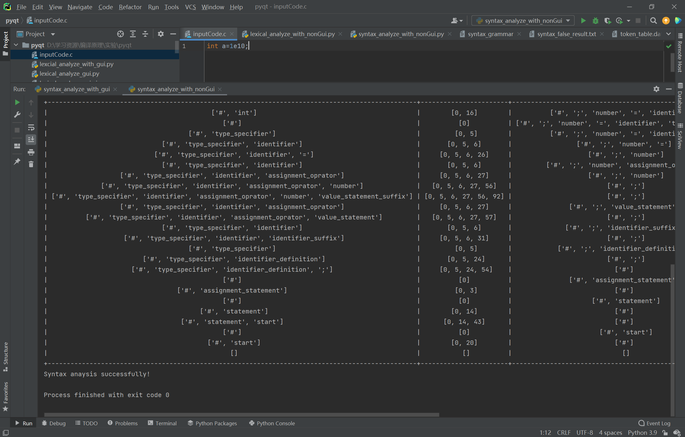

##### 2.运行分析过程展示

###### 1.对于每次分析步骤中token的识别

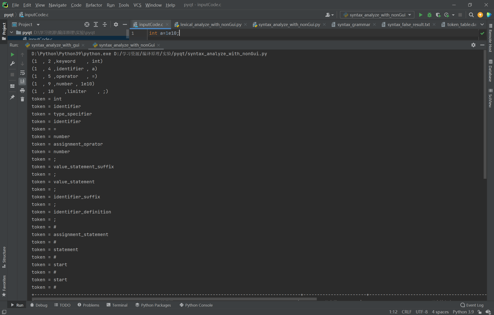

###### 2.分析具体过程，存放在syntax_result.txt中

有符号栈，状态栈，剩余输入串以及动作的信息

第一面

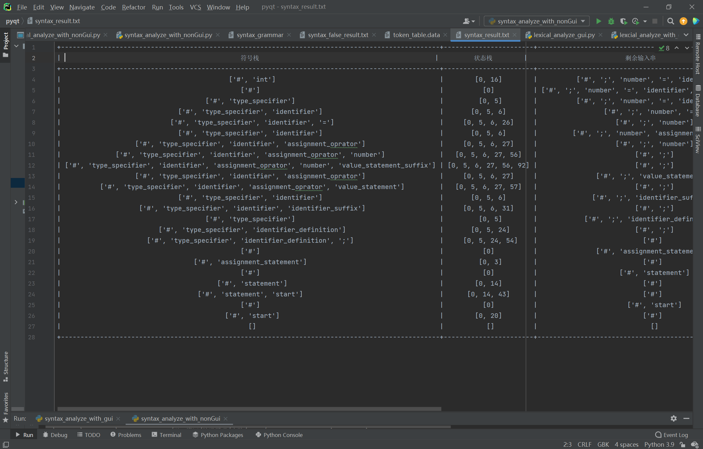

第二面

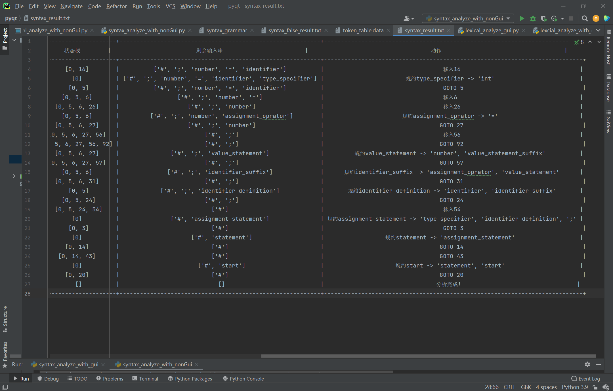


##### 3.错误纠正情况

###### 1.判断为不是LR1文法

在这里我们将syntax_grammar中的17行注释删去（编写读取文法代码已经能够实现对注释删去了），就会发生规约-规约冲突，此时并不是LR(1)文法，在这里我直接使用断言报错

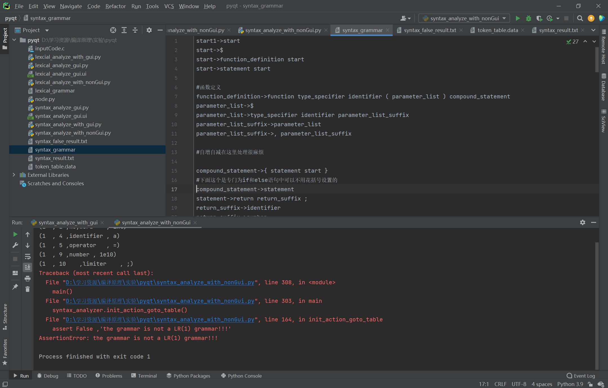

###### 2.输入存在错误

方便理解，我还是选取int a=1e10;这种情况，这次我们把分号去掉，可以看到，控制台告诉了我们当前状态的项集以及它期望的输入。同时也告诉了我们错误在token表以及源代码的哪个地方，都十分清楚


##### 4.复杂代码展示

在这里我们使用test1作为测试，分析成功

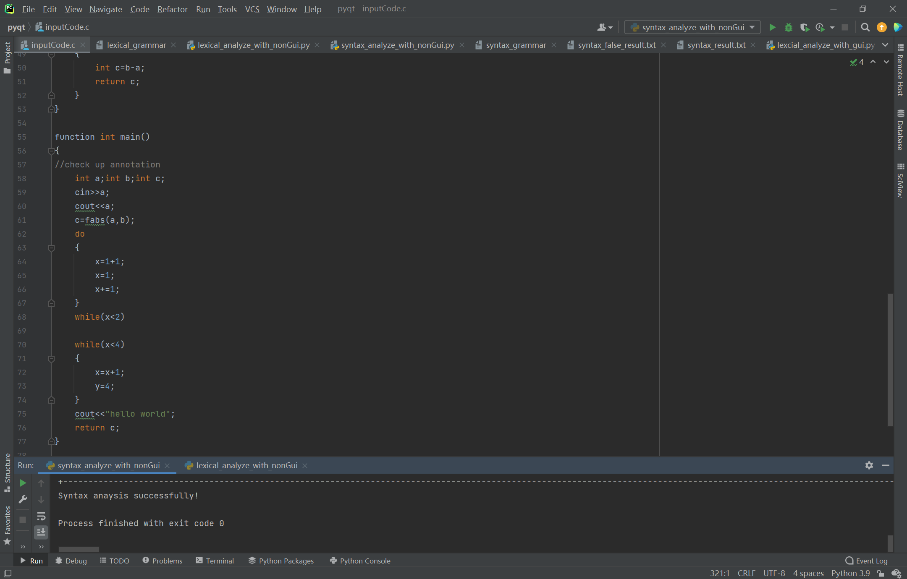

检测输出信息，在这里截取片段，会很长

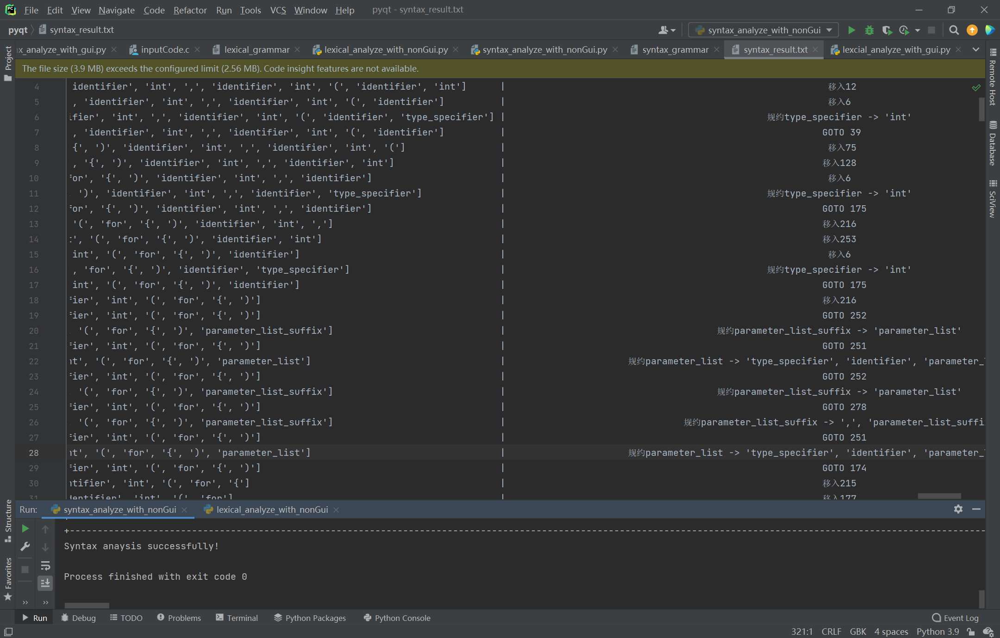

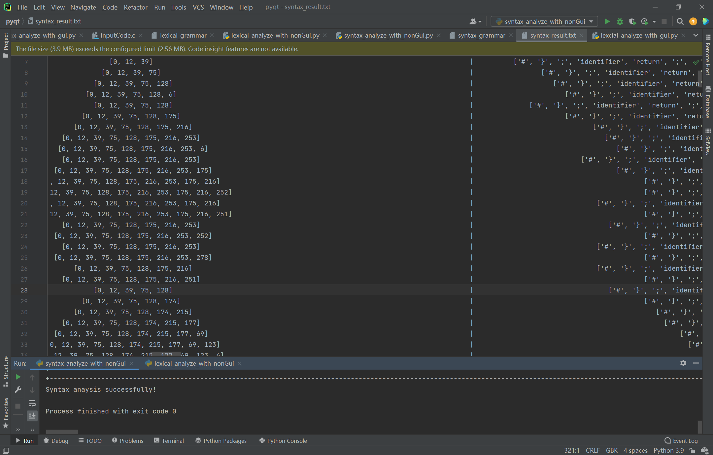


## 个人总结

这个项目大概花费了2周的时间完成，一开始自己是想用c++完成的，但后来由于自己从事科研项目的原因要用到python的原因，便强迫自己用python开发，顺便熟悉这门语言，目前来看python的包挺好用的，无论是pyqt还是prettytable，但是定义变量的时候没有类型标识符有点容易让人产生混淆。实现过程中是本着以可视化ui的基础上做的，因为自己有着qt的基础，用起pyqt倒也能迅速上手。但是在项目进展中发现可视化存在意义其实不怎么大，复杂程序输入费劲，不如写好初始代码之后直接一键运行，并且结果呈现方面很难阅读，因为基于应用窗口所限，光拉拖动条都要许久，不如直接生成文本或者在控制台打印输出来得方便。得此契机自己开始重新思考可视化的意义，项目开发过程到后来基本可视化占次要的地位，仅仅是一个小甜头罢了。

本次项目开发收获良多，首先自己重新复习了遍编译原理，其次初步掌握了python以及pyqt的使用。过程中最让我激动的便是自己错误提示的实现，用自己写的错误提示帮自己纠错是件让人十分兴奋的事情，效率也及其高。

最开始写的过程是痛苦的，因为知识的遗忘，思路的茫然以及纠错的痛苦，而后随着功能模块的一个个实现，过程也开始伴随着些许快乐。遗憾的是自己写的东西也仅仅只能称得上只是个小玩具，连轮子都谈不上，更妄谈成为一种生产工具，因为最终并没有生成目标代码（比如汇编指令）。但即便只是做一个小玩具，这个过程也是有收获有意义的！